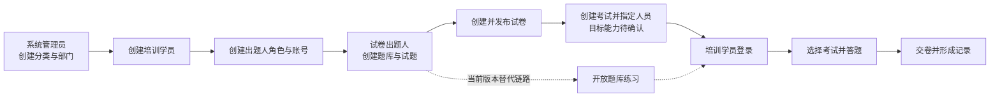

# PlayEdu 端到端基础验收与对外演示场景规划

> 文档状态：规划稿  
> 适用范围：管理后台、PC 学员端，H5 学员端作为兼容性补充  
> 本文只规划角色、业务场景、数据衔接与验收范围，不包含逐步操作、输入数据和逐条预期结果。

## 1. 规划目标

本次基础验收以一条可以对外讲解的企业培训考试故事线为主轴，由三个角色依次完成基础数据准备、试题与试卷生产、学员登录答题，证明系统具备以下能力：

- 系统管理员能够建立组织、人员和后台角色权限；
- 试卷出题人能够维护题库、试题并构建和发布固定试卷；
- 培训学员能够登录学员端，找到本人可参加的考试并完成一次答题；
- 前一角色创建的数据能够被后一角色正确使用，且不同角色看不到或不能操作超出权限的数据；
- 演示过程短、稳定、结果直观，并能在演示结束后定位和清理本次数据。

本文中的“基础验收”优先证明主链路可用，不替代完整功能测试、异常测试、安全测试、性能测试和兼容性测试。

## 2. 产品现状与规划边界

结合当前仓库实现，管理后台已经具备部门、学员、管理员与角色权限管理，以及试题库、试题分类、四类试题、固定组卷、试卷校验和发布等能力；PC/H5 学员端当前已经具备“开放题库练习”和作答记录能力。

需要特别区分以下两条链路：

1. **目标验收链路**：出题人发布试卷 → 创建考试/配置人员范围 → 学员选择该考试试卷 → 正式作答并交卷。
2. **当前可演示链路**：出题人启用题库并开放学员练习 → 学员进入考试中心选择开放题库 → 完成题库练习并查看作答记录。

当前仓库中尚未发现“基于已发布试卷创建考试活动、指定学员、学员正式答卷”的完整管理端和学员端闭环。因此，正式执行验收前应把“考试活动发布与人员分配”作为前置能力确认项：

- 若该能力已在待集成分支或外部模块中提供，则按本文目标链路验收；
- 若该能力尚未提供，则本轮对外演示采用题库练习链路，试卷创建和发布作为后台独立演示段；
- 不应将“学员无法选择已发布试卷”记录为普通用例失败，而应记录为已知范围缺口。

## 3. 角色与职责

| 角色 | 建议账号类型 | 主要职责 | 建议权限边界 |
| --- | --- | --- | --- |
| 系统管理员 | 后台超级管理员或验收专用管理员 | 建立分类、组织、学员和后台角色，完成演示数据底座 | 拥有组织、学员、管理员、角色和日志等管理权限 |
| 试卷出题人 | 后台普通管理员 | 建立题库和试题，构建、校验并发布试卷 | 仅授予试题库查看/编辑及试卷查看/编辑/发布等必要权限 |
| 培训学员 | PC/H5 学员账号 | 登录、找到可见考试或题库、答题和查看结果/记录 | 只能访问本人数据及被授权的考试或开放题库 |

系统管理员与出题人必须使用不同后台账号，以便在演示中直观体现角色分工和权限隔离。

## 4. 端到端业务主线

三组角色场景不是彼此独立的数据孤岛。管理员创建的学员账号必须用于学员端登录；管理员创建的出题人账号必须用于题库和试卷操作；出题人发布的内容必须成为学员最终看到的内容。

## 5. 演示数据规划

### 5.1 统一故事背景

建议使用“2026 新员工信息安全培训”作为演示主题，业务含义清晰，题目容易理解，也便于非技术观众判断结果是否正确。

建议数据层次如下：

- 培训分类：新员工培训 / 信息安全；
- 组织部门：演示集团 / 华东区 / 培训一组；
- 后台角色：信息安全出题人；
- 学员：一名主讲演示学员，另准备一名未授权对照学员；
- 题库：新员工信息安全基础题库；
- 试题分类：账号安全、数据保护、安全事件；
- 试题：覆盖单选、多选、判断和简答四种题型；
- 试卷：2026 新员工信息安全基础考试 A 卷；
- 考试活动：2026 新员工信息安全基础考试（仅目标闭环需要）。

### 5.2 数据命名与隔离

- 所有验收数据统一带可检索前缀，例如 `DEMO-E2E-<日期>-`；
- 账号、编码和名称保持唯一，避免与开发人员已有数据冲突；
- 使用专用验收环境，不连接生产库；
- 数据应按依赖关系逆序清理：答卷/记录 → 考试 → 试卷 → 试题 → 题库 → 人员 → 部门/分类；
- 对外演示环境可以保留一套冻结的基准数据，自动化验收则应使用每次运行唯一的数据标识。

## 6. 系统管理员场景组

本组目标是展示系统从空白基础数据到“组织和角色就绪”的过程，并为后两组场景提供真实账号和组织关系。

| 场景编号 | 场景主题 | 场景意图 | 核心验收关注点 | 优先级 |
| --- | --- | --- | --- | --- |
| SYS-01 | 管理员登录与后台概览 | 证明管理员可进入管理后台并看到符合权限的菜单 | 登录成功、会话有效、关键菜单可见、无越权菜单 | P0 |
| SYS-02 | 创建培训基础分类 | 建立演示所需的课程/资源分类，展示树形分类维护能力 | 分类名称唯一、层级和排序正确、列表可检索 | P1 |
| SYS-03 | 创建组织部门树 | 建立集团、区域、培训组等多级部门 | 父子关系正确、树形展示正确、部门可选择 | P0 |
| SYS-04 | 创建培训学员 | 创建后续登录答题的学员并关联部门 | 账号唯一、状态启用、部门关系正确、可检索 | P0 |
| SYS-05 | 创建出题人角色 | 建立最小权限的考试内容维护角色 | 仅包含题库和试卷所需权限，不包含组织/系统配置权限 | P0 |
| SYS-06 | 创建出题人后台账号 | 将出题人账号绑定到专用角色 | 账号可用、角色关系正确、登录后权限即时生效 | P0 |
| SYS-07 | 验证人员与组织关系 | 从部门和学员视角交叉核对演示人员 | 学员出现在正确部门，搜索和筛选结果一致 | P0 |
| SYS-08 | 验证权限隔离与审计 | 证明后台分权和关键操作可追踪 | 出题人无法管理部门/学员，管理员操作日志可定位关键变更 | P1 |

### 6.1 建议演示顺序

先展示后台概览，再依次建立分类、部门、学员、角色和出题人账号，最后切换账号验证权限边界。演示重点不是表单字段本身，而是“组织人员与后台职责已经为考试流程准备完毕”。

### 6.2 后续拆分用例的边界

SYS 场景后续至少应拆成成功主流程、重复数据校验、必填校验和权限拒绝四类详细用例。本规划阶段不展开导入学员、LDAP 同步、批量移动部门和删除关联数据等扩展流程。

## 7. 试卷出题人场景组

本组目标是使用系统管理员创建的受限账号，完成从题库到正式试卷版本的内容生产流程。

| 场景编号 | 场景主题 | 场景意图 | 核心验收关注点 | 优先级 |
| --- | --- | --- | --- | --- |
| AUT-01 | 出题人登录与权限菜单 | 证明受限后台账号可以进入考试中心 | 可见试题库/试卷库，无部门、学员和系统管理权限 | P0 |
| AUT-02 | 创建并配置题库 | 建立演示题库并配置状态与学员练习开关 | 名称和说明保存成功、状态正确、所有权正确 | P0 |
| AUT-03 | 创建试题分类树 | 在题库内建立多级知识分类 | 分类层级正确、仅作用于当前题库、筛选可用 | P0 |
| AUT-04 | 创建客观题 | 建立单选、多选和判断题 | 编码唯一、选项与标准答案有效、难度/标签/分值完整 | P0 |
| AUT-05 | 创建主观题 | 建立简答题以展示混合题型能力 | 评分要点/参考答案完整，题目能够保存和启用 | P1 |
| AUT-06 | 查询、筛选与预览试题 | 证明题库内容可维护和复核 | 按分类、题型、状态等筛选准确，答案和解析仅后台可见 | P0 |
| AUT-07 | 创建试卷分类 | 建立独立于试题分类的试卷分类 | 分类层级合法、与题库分类互不混淆 | P1 |
| AUT-08 | 新建固定试卷 | 填写试卷基本信息并建立大题结构 | 编码唯一、大题顺序正确、草稿状态正确 | P0 |
| AUT-09 | 从题库选择试题组卷 | 将多个题型加入试卷并设置试卷分值 | 只能选择可用试题、无重复题、题目版本和分值正确 | P0 |
| AUT-10 | 试卷校验与预览 | 在发布前检查题数、结构和总分 | 校验结果无阻断项，预览内容、题序和总分一致 | P0 |
| AUT-11 | 发布正式试卷 | 生成可供考试引用的不可变版本 | 状态变为已发布、正式版本可查看、历史快照稳定 | P0 |
| AUT-12 | 修改后的版本保护 | 展示已发布内容不会被后续编辑覆盖 | 编辑产生新草稿或新版本，原正式版本保持不变 | P1 |
| AUT-13 | 配置学员可答范围 | 将正式试卷用于考试并指定部门/学员 | 考试引用正确试卷版本、目标学员在名单内、对照学员不可见 | P0（目标能力） |

### 7.1 两种演示收口方式

- **正式考试模式**：完成 AUT-13，随后把考试活动名称和学员账号交给 TRA 场景使用。
- **当前题库练习模式**：在 AUT-02 启用题库并打开“开放学员练习”，确保用于练习的客观题均已启用；AUT-07 至 AUT-12 仍可独立展示试卷生产能力，但不声称该试卷已分配给学员。

### 7.2 后续拆分用例的边界

AUT 场景后续应覆盖四种题型的字段规则、无效答案、重复编码、空卷、重复选题、失效试题、分值汇总、乐观锁冲突、发布版本冻结和权限隔离。本轮对外演示只选择最稳定且可直观看懂的成功路径，将批量导入导出、停用、归档和跨所有者操作列入扩展验收。

## 8. 培训学员场景组

本组使用 SYS-04 创建的真实学员账号，验证学员端可见范围和完整作答体验。PC 端作为主演示端，H5 端复用同一业务数据做关键页面兼容性抽查。

| 场景编号 | 场景主题 | 场景意图 | 核心验收关注点 | 优先级 |
| --- | --- | --- | --- | --- |
| TRA-01 | 学员登录 | 使用管理员创建的账号进入学员端 | 登录成功、显示本人信息、会话和跳转正确 | P0 |
| TRA-02 | 查看本人考试入口 | 找到考试中心以及本人可见内容 | 已授权内容可见，未授权或停用内容不可见 | P0 |
| TRA-03 | 查看试卷/考试说明 | 在开考前确认题数、总分、时长和规则 | 展示信息与后台发布配置一致，不泄露答案和解析 | P0（目标能力） |
| TRA-04 | 开始答题 | 创建本人答卷并进入答题页 | 身份和资格校验通过、试卷版本正确、倒计时正确 | P0（目标能力） |
| TRA-05 | 完成混合题型作答 | 回答单选、多选、判断和简答题 | 控件与题型匹配、答案可保存、题目导航状态准确 | P0（目标能力） |
| TRA-06 | 答案保存与恢复 | 验证刷新或重新进入后能继续当前答卷 | 已保存答案不丢失、只恢复本人的进行中答卷 | P1（目标能力） |
| TRA-07 | 检查未答题并交卷 | 展示交卷确认和最终提交 | 未答提示准确、提交幂等、提交后不可继续修改 | P0（目标能力） |
| TRA-08 | 查看成绩或提交状态 | 根据发布策略查看成绩、通过状态或待阅卷状态 | 客观题结果正确；有简答题时状态和成绩开放策略正确 | P0（目标能力） |
| TRA-09 | 查看历史作答记录 | 回到考试中心确认本次记录已形成 | 记录归属本人、时间与状态正确、无他人数据 | P1 |
| TRA-10 | H5 关键路径抽查 | 在移动端验证登录、入口、答题和记录页面 | 页面适配、关键操作可触达、与 PC 数据一致 | P1 |
| TRA-11 | 题库练习替代链路 | 在当前版本中选择开放题库并完成客观题练习 | 题库可见、题目可答、交卷结果和作答记录正确 | P0（当前版本） |

### 8.1 正式考试模式的演示重点

演示应突出三个事实：学员只能看到分配给自己的考试；答题页不包含标准答案和解析；交卷后结果展示遵循后台配置。若试卷包含简答题，应提前决定是演示“待阅卷”状态，还是另准备一份纯客观题试卷用于现场即时出分。

### 8.2 当前题库练习模式的演示重点

学员进入“考试中心”的“开放题库”，选择出题人刚创建并开放的题库，完成若干客观题后提交，并在“我的作答”查看记录。简答题不纳入当前练习主链路，以免与正式考试人工阅卷能力混淆。

## 9. 跨角色联合验收场景

在三组独立演示完成后，使用以下联合场景确认数据真正贯通。

| 场景编号 | 联合场景 | 参与角色 | 联合验收结论 |
| --- | --- | --- | --- |
| E2E-01 | 从组织建档到学员登录 | 系统管理员、培训学员 | 后台创建并启用的学员能够登录，姓名和部门信息一致 |
| E2E-02 | 从角色授权到出题登录 | 系统管理员、试卷出题人 | 出题人可以完成内容生产，但不能进入组织和系统配置模块 |
| E2E-03 | 从题库建题到固定组卷 | 试卷出题人 | 试卷引用正确题目版本，结构、题数和总分在预览与正式版本中一致 |
| E2E-04 | 从试卷发布到学员交卷 | 试卷出题人、培训学员 | 目标学员可见并完成指定试卷，对照学员不可见，答卷绑定正确版本（目标能力） |
| E2E-05 | 从开放题库到练习记录 | 试卷出题人、培训学员 | 开放且启用的题库可被学员练习，停用或未开放内容不可见（当前版本） |
| E2E-06 | 数据隔离与答案保护 | 三类角色 | 学员不能读取标准答案/解析或他人记录，出题人不能管理系统基础数据 |

## 10. 对外演示编排

建议把演示控制在 25～35 分钟，按下列节奏组织：

| 阶段 | 建议时长 | 演示内容 | 主要讲解价值 |
| --- | ---: | --- | --- |
| 开场 | 2 分钟 | 介绍三类角色和业务故事 | 建立端到端上下文 |
| 系统管理员 | 7～9 分钟 | 分类、部门、学员、角色和出题人账号 | 展示组织化管理与分权 |
| 试卷出题人 | 10～12 分钟 | 题库、分类、典型试题、固定组卷、校验与发布 | 展示考试内容生产能力 |
| 培训学员 | 6～8 分钟 | 登录、选择考试/题库、答题、提交和记录 | 展示最终用户体验与数据贯通 |
| 收尾 | 2～4 分钟 | 展示版本/记录/权限隔离并总结 | 证明结果可追踪且安全 |

现场不建议逐题创建全部演示题。可以预置大部分数据，只现场新建一个部门、一个学员和一到两道典型题，再将其接入已经准备好的完整题库和试卷，以降低输入时间和网络波动风险。

## 11. 执行前置条件

- Admin、PC、H5 和 API 服务健康，使用独立且可重置的验收数据库；
- 管理端超级管理员账号可用，并已修改公开默认密码；
- PC/H5 学员端与管理端连接同一套后端数据；
- 系统时间和时区一致，正式考试模式下尤其需要验证服务端时间；
- 已确认题库、试卷、考试相关许可和权限均已启用；
- 正式考试模式已具备考试活动、人员范围、答卷和成绩能力；否则明确切换到题库练习模式；
- 浏览器缓存、旧登录态和历史演示数据已处理，不影响当次展示；
- 准备主演示账号、对照账号和只读备用账号，但不在本文提交真实密码。

## 12. 验收准入与完成标准

### 12.1 准入标准

- P0 场景所依赖的接口和页面已经部署；
- 演示基准数据能够初始化或恢复；
- 已知问题已标注是否影响主链路；
- 角色账号及权限已经过一次预演验证。

### 12.2 完成标准

- 所有适用于当前模式的 P0 场景通过；
- SYS → AUT → TRA 的数据传递无人工改库；
- 无越权访问、答案泄露、他人答卷泄露等阻断问题；
- 对外演示过程中无必须依赖开发人员临时修复的数据；
- 失败时能够通过页面提示、接口响应或后台日志定位原因；
- 当前未实现的目标能力作为范围缺口单独登记，不与已实现能力的验收结果混合。

## 13. 风险与预案

| 风险 | 影响 | 预案 |
| --- | --- | --- |
| 正式考试分配和答卷闭环尚未实现 | 无法完成“选择试卷答题”的目标演示 | 采用题库练习替代链路，并明确后台试卷段与学员练习段尚未连通 |
| 角色权限配置过多或过少 | 演示越权或菜单缺失 | 固化一份出题人角色权限清单，演示前用该账号预登录验证 |
| 现场逐条录入耗时或输入错误 | 演示节奏失控 | 预置完整数据，只现场创建少量代表性数据 |
| 试卷含简答题无法即时出分 | 收尾效果不明确 | 主演示使用纯客观题卷；混合题型卷用于展示待阅卷状态 |
| 历史数据重名 | 创建失败或检索混乱 | 使用统一日期前缀和唯一编码，预演后清理或重置环境 |
| PC/H5 数据不一致 | 对外观感差 | PC 作为主端，H5 只做已预验的关键路径抽查 |

## 14. 下一阶段交付物

本规划评审确认后，再进入真实测试用例设计和自动化实现。下一阶段建议产出：

1. 按 `场景编号-用例序号` 拆分的详细测试用例表，字段包括前置条件、测试数据、操作步骤、预期结果、优先级和清理动作；
2. 一套不含真实密码的验收数据字典和角色权限矩阵；
3. 正式考试模式与题库练习模式各一份演示脚本；
4. P0 主链路的 Playwright 自动化清单，以及不适合自动化的人工检查清单；
5. 已知功能缺口、环境问题和演示限制清单。

详细用例设计时应优先实现 `SYS-01～SYS-07`、`AUT-01～AUT-11`，再根据产品能力选择 `TRA-01～TRA-09` 的正式考试链路或 `TRA-01、TRA-02、TRA-11、TRA-09` 的当前题库练习链路。
