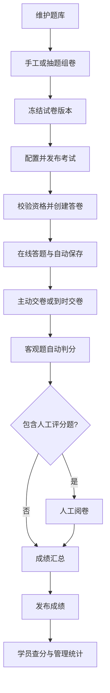

# PlayEdu 考试中心管理模块规划

> 编写日期：2026-09-05  
> 文档定位：功能与实施规划，供产品评审、原型设计和开发拆分使用。本文新增模块、表结构、接口及性能指标均为建议方案，尚未实现。  
> 规划目标：在现有课程学习基础上，建立覆盖题库管理、试卷组卷、考试组织、在线答题、阅卷和成绩管理的完整闭环。

## 1. 项目基础与建设原则

### 1.1 现有能力

根据当前仓库的 README、Maven 配置、前端路由、课程接口及数据库定义，项目具备以下可复用基础：

| 现有能力 | 考试中心的复用方式 |
| --- | --- |
| 学员、部门及部门成员关系 | 选择考试对象、识别考生身份、按部门统计 |
| 管理员、角色、权限和操作日志 | 控制出题、组卷、发布、阅卷、查分和导出权限 |
| 课程、课时与学习进度 | 关联课后考试、校验学习完成条件 |
| 文件资源与 S3/MinIO 兼容存储 | 存储题干图片、导入文件和成绩导出文件 |
| 管理后台、PC 学员端、H5 学员端 | 分别承载考试管理、PC 答题和移动答题 |
| Spring Boot、MyBatis-Plus、MySQL | 承载考试领域服务、持久化和事务处理 |

当前后端使用 Java 17、Spring Boot 3.3.4，管理端使用 React 18、TypeScript、Ant Design 5。建议保持现有技术栈与部署方式，新增独立考试业务模块。

### 1.2 设计原则

1. 区分“题目”“试卷”“考试”：题目是素材，试卷是题目与分值的组合，考试是试卷面向指定人群的一次组织活动。
2. 试卷可以被多场考试复用，同一考试可以产生多次答卷；历史答卷必须能独立追溯。
3. 先交付完整考试闭环，再增加复杂评分、防作弊、分析和证书能力。
4. 发布时间、作答截止时间、分值、身份和成绩均由服务端校验。
5. 题目、试卷和考试规则在正式使用后保留版本或快照，避免后续编辑改变历史结果。

## 2. 建设范围与角色

### 2.1 分期范围

| 能力 | 首期 P0：完整闭环 | 二期 P1：增强能力 |
| --- | --- | --- |
| 题库 | 题库、分类、标签、难度、单选/多选/判断/简答、批量导入导出、版本管理 | 填空题、组合材料题、音视频题、题目审核 |
| 组卷 | 手工组卷、按条件抽题生成固定试卷、预览、校验、版本冻结 | 每名考生动态随机组卷、多套等价卷 |
| 考试 | 独立考试、关联课程、指定部门/学员、时间与次数规则 | 预约考试、审批、考试通知、补考计划 |
| 答题 | PC/H5 答题、自动保存、断线恢复、限时、到时交卷 | 练习模式、错题本、更多防作弊策略 |
| 阅卷 | 客观题自动判分、简答题人工评分、复核改分 | 双人阅卷、仲裁、评分模板 |
| 成绩 | 查询、发布、导出、统计、作废、缺考识别 | 学员申诉流程、证书、跨场次分析 |

首期“随机组卷”指管理员抽题后生成固定试卷，同场考试使用相同题目；每人不同题属于二期，避免在首期引入试卷等价性和抽题失败处理的复杂性。

### 2.2 角色与权限

角色通过现有管理员角色体系组合配置，不新增独立管理员账号体系。

| 角色 | 主要职责 | 数据访问边界 |
| --- | --- | --- |
| 考试管理员 | 配置考试、发布、指定阅卷人、管理成绩 | 授权题库和考试 |
| 题库管理员/出题人 | 维护题库与题目、查看答案和解析 | 被授权题库 |
| 组卷人员 | 选择题目、配置分值、生成试卷 | 被授权题库和试卷 |
| 阅卷人员 | 批阅简答题、填写评语 | 分配给自己的考试答卷 |
| 成绩查看人员 | 查看统计、按权限导出成绩 | 授权考试或部门范围 |
| 学员 | 参加考试、查看本人已发布成绩 | 本人的考试资格、答卷和成绩 |

首期增加题库授权关系、考试授权关系；部门统计范围通过考试授权与部门范围共同过滤。权限需覆盖接口和查询条件，前端隐藏按钮仅作为交互辅助。

## 3. 菜单与页面规划

### 3.1 管理后台

```text
考试中心
├─ 题库管理
│  ├─ 题库列表及授权
│  ├─ 题目列表/编辑/详情
│  ├─ 分类与标签
│  └─ 导入任务与错误报告
├─ 试卷管理
│  ├─ 试卷列表
│  ├─ 手工组卷/抽题组卷
│  └─ 预览与版本详情
├─ 考试管理
│  ├─ 考试列表/创建向导
│  └─ 考试详情：规则、人员、进度、成绩
├─ 阅卷中心
│  ├─ 待阅卷列表
│  └─ 阅卷工作台
└─ 成绩管理
   ├─ 成绩明细/答卷详情
   ├─ 考试统计/部门统计
   └─ 导出任务
```

### 3.2 学员端

PC/H5 新增“考试中心”，包含考试列表、考试详情与须知、答题页、交卷结果、我的成绩和答卷回顾。课程详情增加“关联考试”入口。

考试列表展示考试名称、关联课程、考试时间、时长、剩余次数、资格状态和操作入口。答题页提供倒计时、题号导航、已答/未答标记、稍后检查标记、保存状态和交卷确认；H5 使用抽屉式答题卡。

## 4. 题库管理

### 4.1 题库与题目字段

| 对象 | 主要字段 |
| --- | --- |
| 题库 | 名称、编码、描述、负责人、授权人员、启用状态、创建时间 |
| 分类 | 所属题库、父分类、名称、排序；首期最多三级 |
| 题目 | 编码、所属题库、分类、题型、题干、选项、答案、解析、难度、标签、建议分值、状态、版本、维护人 |
| 简答题附加字段 | 参考答案、评分要点；参考答案不用于自动判分 |
| 题目版本 | 版本号、内容快照、修改人、修改时间、修改说明 |

难度采用简单、一般、困难三级；标签支持知识点、岗位或培训主题。建议分值只在加入试卷时提供默认值，实际得分以试卷版本中的分值为准。

### 4.2 首期题型与判分

| 题型 | 内容约束 | 判分方式 |
| --- | --- | --- |
| 单选题 | 至少两个选项，且唯一正确选项 | 选对得满分，选错或未答得零分 |
| 多选题 | 至少三个选项、至少两个正确选项 | 首期完全匹配得满分，漏选、多选、错选均为零分 |
| 判断题 | 正确/错误两个固定选项 | 与标准答案一致得满分，否则零分 |
| 简答题 | 题干、参考答案、评分要点 | 人工给出 0 至本题满分之间的分数 |

选项使用稳定标识保存答案，展示字母由页面生成，避免选项顺序改变后答案错位。金额式分数使用定点小数，最多两位小数；零分合法，各题满分必须大于零。

### 4.3 管理操作与约束

- 支持新增、编辑、复制、预览、批量分类、批量打标签、启用、停用及归档。
- 支持按关键词、题型、分类、难度、标签、状态、创建人筛选。
- 题目状态为草稿、启用、停用、归档；只有启用题目可加入新试卷。
- 修改题干、选项、答案或解析产生新版本；已冻结试卷继续引用原版本。
- 未被引用的草稿允许删除；已有引用的题目只允许停用或归档。
- 停用题目不自动改变已经发布的考试。发现错题时，由管理员明确决定取消考试、统一调整该题得分或作废答卷，并保留处理理由。
- 题干支持经过安全过滤的富文本和图片，资源权限与题库权限一致。

### 4.4 批量导入导出

首期提供 Excel 模板，列包含题型、分类路径、题干、选项 A～H、正确答案、解析、难度、标签、建议分值；简答题另有评分要点。首期批量导入仅支持文本，图片通过题目编辑页补充。

流程：下载模板 → 上传 → 服务端解析与预校验 → 展示成功/失败预览 → 确认入库 → 下载结果报告。

校验包括必填项、题型、答案对应选项、重复编码、分值范围和长度限制。题干相同提示疑似重复，由操作人选择是否保留。默认整批校验通过后入库，失败文件不产生部分题目；请求幂等标识防止重复确认入库。建议首期每批最多 1,000 题，超过限制提示拆分。

导出题目及答案需要单独权限，记录导出人、范围和时间。Excel 导出按文本写入用户内容，避免被解释为公式。

## 5. 试卷组卷

### 5.1 基础信息与结构

试卷包含名称、分类、说明、推荐时长、总分、版本、状态和创建人。考试实际时长、及格分、考试人员等放在考试配置中。

支持按题型划分大题，设置大题标题、说明和排序；题目支持拖动排序、单题分值设置、同题型批量设分、移除和替换。页面实时汇总题数、题型数量及总分。

### 5.2 手工组卷

1. 新建试卷并填写基本信息。
2. 按题库、分类、标签、题型和难度筛选题目。
3. 勾选题目加入各大题；同一试卷内不允许出现同一题目的不同版本。
4. 设置分值、排序和说明。
5. 预览管理版与学员版，管理版可显示答案，学员版隐藏答案和解析。
6. 完成校验并冻结为可用版本。

### 5.3 按规则抽题生成固定试卷

每条规则配置题库范围、分类/标签、题型、难度、数量和每题分值。系统先计算候选题数量，再在所有规则间去重分配题目，最后生成固定题目清单。

示例：单选 20 题 × 2 分 + 多选 10 题 × 3 分 + 判断 10 题 × 1 分 + 简答 2 题 × 10 分 = 100 分。

规则之间存在重叠时，不能只校验单条规则数量；必须校验去重后能否同时满足全部规则。抽题不足时，明确指出不足规则和缺少数量，不生成残缺试卷。允许重新抽取及手动替换，保存抽题条件供追溯。

### 5.4 校验与版本

- 空试卷、无有效答案的客观题、无分值题、重复题不得冻结。
- 总分由各题累加，冻结时与大题汇总再次核对。
- 试卷状态：草稿 → 可用 → 停用；冻结产生不可变版本。
- 修改可用试卷时创建新草稿和新版本，历史考试继续绑定原版本。
- 考试发布时绑定具体试卷版本；考试进行中不得替换试卷。
- 停用试卷阻止新考试引用，已发布考试继续使用其冻结版本。

## 6. 考试组织与课程联动

### 6.1 创建向导

| 步骤 | 配置内容 |
| --- | --- |
| 基本信息 | 考试名称、说明、负责人、独立考试/课程考试、关联课程 |
| 选择试卷 | 可用试卷版本、总分预览、及格分 |
| 人员范围 | 指定学员、指定部门、是否包含子部门 |
| 考试规则 | 开始/结束时间、答题时长、最晚进入时间、次数、学习门槛 |
| 阅卷与成绩 | 阅卷人员、成绩发布方式、答案解析开放策略 |
| 发布确认 | 人员数量、试卷版本、题数总分、时间、规则摘要 |

发布时间范围要求开始时间小于结束时间，答题时长大于零，及格分在 0 至总分之间。所有展示时间使用统一时区，接口传输带时区的时间或时间戳，服务端统一比较。

### 6.2 考试人员

- 选择部门时明确是否包含下级部门，发布时展开并去重，生成具体考生名单。
- 保存当时的姓名、部门归属和选人规则快照；此后人员调部门不改写历史名单与统计。
- 考试开始前允许显式增删名单并记录日志；考试开始后首期仅允许增补人员，已产生答卷的人员不能删除。
- 学员有多个部门时，在名单中确定一个本场统计归属部门，避免部门汇总重复计数；同时保存全部部门关系供查询。
- 后续新入部门人员不自动加入已发布考试，由管理员手动增补。

### 6.3 时间、次数与成绩规则

| 规则 | 首期约定 |
| --- | --- |
| 入场 | 在开始时间之后、最晚进入时间之前且考试未结束，服务端检查名单、账号状态和资格 |
| 作答截止 | `min(本次开始时间 + 答题时长, 考试结束时间)` |
| 作答次数 | 默认 1 次，可配置多次；已正式开考即占用一次，断线重连沿用该次 |
| 并行答卷 | 同一学员同一考试同时最多有一份作答中的答卷 |
| 重考 | 上一次交卷后且仍满足时间和次数条件才可再次进入 |
| 最终成绩 | 多次考试默认取最高有效成绩；同分取更早提交的答卷 |
| 待阅卷 | 仍有有效答卷待阅时，最终成绩保持待确定，不提前认定不及格 |
| 成绩发布 | 默认考试结束、有效答卷全部评完后，由管理员统一发布 |
| 答案解析 | 默认考试结束且成绩发布后可见；可配置为始终不可见 |

即使配置交卷后立即公布分数，也应将答案与解析开放时间独立控制；允许重考的考试默认结束后开放答案，避免影响后续作答公平性。

### 6.4 状态与变更

考试业务状态为草稿、已发布、已取消、已归档；“未开始、进行中、已结束”根据已发布状态与服务端时间计算。阅卷进度和成绩发布状态独立展示。

- 草稿可修改全部配置。
- 发布后、开始前可修改人员和时间等规则并留痕；若需换卷，撤回为草稿再重新发布。
- 已经开始后，首期锁定试卷、评分、次数和时间规则，避免不同考生规则不一致。
- 紧急取消需填写原因，阻止新开考并终止进行中的答卷，历史答案保留，取消考试不纳入正常成绩统计。
- 归档只影响展示与管理入口，不删除答卷及成绩。

### 6.5 课程联动

首期一场考试可选择关联一门课程，一门课程可关联多场考试；独立考试无需课程。

可配置“无需学习门槛”或“课程进度达到指定比例后可参加”。开考时通过现有学习进度服务校验，结果记录在答卷中。考试资格还需满足课程可访问条件。

课程学习完成与考试通过分开保存和展示。首期不修改现有课程完成率计算；二期再增加“学习完成且考试通过才算培训完成”的独立培训完成规则。

## 7. 在线答题与交卷

### 7.1 主流程



### 7.2 保存与恢复

- 开考请求成功后返回答卷 ID、服务端当前时间、截止时间和不含标准答案的题目数据。
- 选择题变更后自动保存，文本答案采用约 2 秒防抖保存，另以约 15 秒周期补偿保存。
- 显示“保存中、已保存、保存失败”，失败时自动重试并保留当前页面内容。
- 服务端为每条答案使用递增版本号，拒绝旧请求覆盖新答案；重复请求返回已处理结果。
- 刷新或重新登录后从服务端恢复原答卷、答案及截止时间，不重置计时。
- 网络断开期间不暂停考试。超过截止时间的新答案不再接收；交卷以截止前成功保存的数据为准，页面提前告知保存状态。
- 使用作答会话标识处理多标签页或多设备写入；接管会话需显式操作，旧会话后续写入被拒绝。

### 7.3 交卷与自动交卷

主动交卷前提示未答数量，允许确认提交。提交接口携带最后一批答案及幂等标识，在截止时间校验、答案保存、答卷锁定的同一事务中完成，解决保存请求与交卷请求的竞态。

服务端定时扫描到期的作答中答卷，通过条件更新抢占处理权并自动交卷；客户端倒计时归零也可触发交卷。两条路径共享同一幂等服务，避免重复计分。应用重启后补扫已到期答卷。

答卷状态：作答中 → 已提交待评分 → 待人工阅卷（如有）→ 已评完。作废作为独立有效性标记；各状态转换保存时间和原因。判分异常保留已提交状态并进入可重试队列或任务表，不要求学员重新答题。

## 8. 阅卷与成绩管理

### 8.1 自动判分与人工阅卷

客观题根据答卷绑定的答案快照进行判分，记录逐题得分与判分规则版本。简答题按评分要点人工给分，支持评语、上一题/下一题、暂存和提交阅卷。

阅卷任务首期按整份答卷分配，每份答卷有一名负责阅卷人；认领和提交使用状态与版本校验，避免两人覆盖。只有全部人工题评分完成后才能提交整份阅卷。

同一题得分不得小于零或超过满分。客观分与主观分求和为答卷总分，总分达到及格分即通过。试卷原始分值、答题内容与答案快照不因改分发生变化。

### 8.2 成绩列表与详情

| 页面 | 核心信息与操作 |
| --- | --- |
| 成绩列表 | 考试、学员、统计部门、次数、客观分、主观分、总分、是否通过、用时、阅卷/发布状态 |
| 筛选 | 考试、姓名/账号、部门、通过情况、成绩区间、待阅卷、缺考、作废 |
| 答卷详情 | 题干快照、学员答案、标准答案、逐题得分、评语、保存/交卷时间、历史操作 |
| 成绩发布 | 发布预览、待阅数量提示、发布确认、撤回发布及原因 |
| 数据导出 | 按当前授权筛选结果导出汇总；逐题明细和标准答案需要额外权限 |

学员只能查看本人已发布成绩。成绩尚未发布时展示“已交卷/待阅卷/待发布”，不通过其他详情接口泄露分数。个人答卷回顾是否显示标准答案与解析由考试策略控制。

### 8.3 改分、作废与重新汇总

- 改分需要独立权限、修改原因、修改前后分值以及操作人；按题修改并重新计算总分，禁止只改汇总分。
- 批量错题处理需明确适用的试卷版本和题目版本，对本场所有匹配答卷执行同一规则，防止只调整部分考生。
- 成绩已发布后改分或作废，生成新成绩版本，将本场成绩转为待重新发布，重新汇总后统一发布；保留旧发布记录。
- 作废答卷保留全部数据，不参与最高分、平均分与通过人数计算；该次考试次数默认仍消耗，需要重考时由授权管理员单独追加次数并填写原因。
- 成绩重新汇总需覆盖多次考试最高分、通过状态、统计数据及导出结果。

### 8.4 统计口径

| 指标 | 计算口径 |
| --- | --- |
| 应考人数 | 当前考试有效考生名单去重人数，增补与移除保留审计 |
| 参考人数 | 至少正式开考一次的学员人数，另列全部答卷作废人数 |
| 缺考人数 | 考试结束后应考名单中从未开考的人数；资格未达标者单独标记原因 |
| 交卷人数 | 至少完成一次提交的学员人数 |
| 成绩人数 | 存在有效已评答卷且无有效待评答卷的学员人数 |
| 通过人数/通过率 | 最终成绩达到及格线的人数；通过率 = 通过人数 ÷ 成绩人数 |
| 应考达标率 | 通过人数 ÷ 应考人数，与通过率分开展示 |
| 平均分/最高分/最低分 | 按每名学员的最终有效成绩统计，多次答卷不重复计入 |
| 分数段 | 按总分百分比设置区间，并显示各区间人数 |
| 客观题正确率 | 按每人最终选定有效答卷统计满分人数 ÷ 该题作答资格人数，未答计错误 |

分母为零展示“—”。阅卷未完成或考试未结束时注明“阶段性数据”。按部门统计采用发布/增补名单中的统计部门快照。简答题使用平均得分率，不与客观题正确率混合。

## 9. 数据模型建议

以下为逻辑模型，字段名及类型需在开发时与现有数据库约定统一。新增表建议使用 `exam_` 前缀，通用字段包含主键、创建/更新时间；需要并发控制的表增加 `version`。

| 表名 | 关键字段 | 用途 |
| --- | --- | --- |
| `exam_question_banks` | name、code、owner_id、status | 题库 |
| `exam_bank_admins` | bank_id、admin_id、capabilities | 题库数据授权 |
| `exam_question_categories` | bank_id、parent_id、name、sort | 分类树 |
| `exam_question_tags` | bank_id、name | 标签字典 |
| `exam_question_tag_rel` | question_id、tag_id | 题目标签关系 |
| `exam_questions` | bank_id、category_id、code、type、difficulty、current_version_id、status | 题目主档 |
| `exam_question_versions` | question_id、version_no、content_json、answer_json、analysis、change_reason | 不可变题目内容、选项和评分要点 |
| `exam_papers` | name、status、current_version_id、owner_id | 试卷主档与草稿定位 |
| `exam_paper_versions` | paper_id、version_no、status、total_score、section_json、draw_rules_json | 草稿编辑；冻结后不可变 |
| `exam_paper_items` | paper_version_id、question_version_id、section_key、sort、score | 试卷题目与分值 |
| `exam_exams` | name、paper_version_id、course_id、start_at、end_at、duration、pass_score、rules_json、status、result_status | 考试活动及冻结规则 |
| `exam_exam_admins` | exam_id、admin_id、capabilities、department_scope_json | 考试管理、阅卷、成绩数据授权 |
| `exam_participants` | exam_id、user_id、identity_snapshot、department_snapshot、stat_department_id、extra_attempts、status | 应考名单与个人次数追加 |
| `exam_attempts` | exam_id、user_id、attempt_no、status、validity、started_at、deadline_at、submitted_at、score、session_version | 一次答卷与截止时间 |
| `exam_attempt_items` | attempt_id、paper_item_id、question_snapshot、answer_key_snapshot、max_score、sort | 作答题目快照，答案字段仅供服务端使用 |
| `exam_answers` | attempt_item_id、answer_json、answer_version、saved_at、score、comment | 学员答案及逐题得分 |
| `exam_grading_tasks` | attempt_id、grader_id、status、version、finished_at | 阅卷分配与并发控制 |
| `exam_results` | exam_id、user_id、selected_attempt_id、final_score、passed、version | 每名学员最终成绩投影，可从答卷重建 |
| `exam_result_publications` | exam_id、version_no、result_snapshot、published_by、published_at、status | 历次成绩发布记录 |
| `exam_score_logs` | attempt_item_id、old_score、new_score、reason、operator_id、created_at | 改分审计 |
| `exam_jobs` | type、scope_json、status、idempotency_key、retry_count、error、file_resource_id | 导入、导出与失败判分重试 |

主要关系：题库 1:N 题目，题目 1:N 版本，试卷版本 N:M 题目版本，试卷版本 1:N 考试，考试 1:N 考生名单与答卷，答卷 1:N 答题项，答题项 1:1 当前答案。

### 9.1 约束与索引

- 唯一约束：`(bank_id, code)`、`(question_id, version_no)`、`(paper_id, version_no)`、`(exam_id, user_id)` 考生与最终成绩、`(exam_id, user_id, attempt_no)`、`attempt_item_id` 答案。
- 开考时锁定考生记录，在同一事务校验次数、检查已有进行中答卷并创建答卷，防止并发重复开考。
- 自动交卷索引：`exam_attempts(status, deadline_at)`；阅卷索引：`exam_grading_tasks(grader_id, status)`。
- 考试列表索引：`exam_exams(status, start_at, end_at)`；成绩筛选索引：`exam_results(exam_id, final_score)`；题库筛选按常见组合设置索引。
- 分值使用 `DECIMAL`，身份关联字段类型与原有用户、部门主键一致。
- 业务关联保留引用完整性；删除用户、课程或资源时处理关联限制，禁止级联删除历史答卷。
- 快照中的题图仍需保留资源引用或不可变资源标识，资源清理任务应排除被有效考试历史引用的文件。

## 10. 工程落地与接口建议

### 10.1 目录和集成位置

| 工程位置 | 建议改动 |
| --- | --- |
| `playedu-api/pom.xml` | 注册 `playedu-exam` Maven 子模块 |
| `playedu-api/playedu-exam/` | 新增考试 Entity、Mapper、Service、评分策略、状态转换服务及 Mapper XML |
| `playedu-api/playedu-api/pom.xml` | 增加考试模块依赖 |
| `playedu-api/playedu-api/src/main/java/xyz/playedu/api/` | 按已有 backend/frontend 分层新增 Controller、Request 和任务编排 |
| `playedu-api/playedu-common/` | 按已有方式扩展权限常量和必要的公共类型 |
| `playedu-api/playedu-system/` | 接入现有权限初始化检查与数据库迁移流程 |
| `playedu-api/sql/` | 增加独立考试增量 SQL，评审后同步全新安装基线 |
| `playedu-admin/src/pages/exam/` | 新增题库、试卷、考试、阅卷、成绩页面 |
| `playedu-admin/src/api/`、`src/routes/index.tsx`、`src/compenents/left-menu/` | 注册管理接口、路由、菜单和权限按钮 |
| `playedu-pc/src/`、`playedu-h5/src/` | 新增考试页面、接口封装及课程考试入口 |

建议考试领域模块依赖 common 和资源能力，课程进度校验由 API 编排层调用课程服务后传入考试服务，避免 course 与 exam 相互依赖。继续使用现有鉴权、`JsonResponse`、分页和日志方式。

### 10.2 接口分组

以下路径为后端 Controller 层规划，沿用已观察到的后台 `/backend/v1`、学员端 `/api/v1` 前缀。前端通过各自现有 HTTP 客户端及网关配置拼接，不直接重复添加代理前缀。

| 端 | 方法与示例路径 | 说明 |
| --- | --- | --- |
| 管理 | `GET/POST /backend/v1/exam/banks` | 查询/创建题库 |
| 管理 | `GET/POST /backend/v1/exam/questions` | 查询/创建题目 |
| 管理 | `PUT /backend/v1/exam/questions/{id}` | 编辑并生成题目版本 |
| 管理 | `POST /backend/v1/exam/question-imports` | 上传校验任务；确认入库使用独立确认接口 |
| 管理 | `GET/POST /backend/v1/exam/papers` | 查询/创建试卷 |
| 管理 | `POST /backend/v1/exam/papers/{id}/draw` | 抽题生成草稿 |
| 管理 | `POST /backend/v1/exam/papers/{id}/freeze` | 校验并冻结版本 |
| 管理 | `GET/POST /backend/v1/exam/exams` | 查询/创建考试 |
| 管理 | `POST /backend/v1/exam/exams/{id}/publish` | 校验规则并发布名单 |
| 管理 | `GET /backend/v1/exam/grading-tasks` | 阅卷任务列表 |
| 管理 | `POST /backend/v1/exam/attempts/{id}/grade` | 提交人工阅卷 |
| 管理 | `POST /backend/v1/exam/attempts/{id}/adjust-score` | 审计改分 |
| 管理 | `GET /backend/v1/exam/results` | 成绩筛选查询 |
| 管理 | `POST /backend/v1/exam/exams/{id}/publish-results` | 发布成绩版本 |
| 管理 | `GET /backend/v1/exam/exams/{id}/statistics` | 统计 |
| 管理 | `POST /backend/v1/exam/result-exports` | 创建导出任务 |
| 学员 | `GET /api/v1/exam/exams` | 本人可见考试 |
| 学员 | `GET /api/v1/exam/exams/{id}` | 详情、资格和剩余次数 |
| 学员 | `POST /api/v1/exam/exams/{id}/start` | 幂等开考或恢复当前答卷 |
| 学员 | `GET /api/v1/exam/attempts/{id}` | 读取本人答卷与已存答案 |
| 学员 | `PUT /api/v1/exam/attempts/{id}/answers` | 批量保存，携带答案版本和作答会话 |
| 学员 | `POST /api/v1/exam/attempts/{id}/submit` | 原子保存最后答案并交卷 |
| 学员 | `GET /api/v1/exam/results` | 本人已发布成绩 |

其余详情、停用、授权、取消、增补名单、作废、成绩撤回和任务查询接口按相同资源分组补齐。错误需可区分资格不足、尚未开始、已截止、次数耗尽、答卷已提交、版本冲突、无权限，前端给出对应处理提示。

## 11. 安全、可靠性与容量

1. **答案隔离**：学员答题 DTO 不包含标准答案、评分要点、解析和正确选项标记；禁止通过通用实体序列化泄露答案。
2. **归属校验**：读取、保存、提交答卷均校验登录用户与答卷归属；阅卷、导出同时校验操作权限和数据范围。
3. **内容安全**：富文本过滤脚本，上传校验格式与大小；题目附件通过授权访问，导出文件限时下载。
4. **可信计时**：倒计时以服务端返回的截止时间校正，修改本地时间不会延长考试。
5. **事务与幂等**：开考、保存、交卷、判分、改分和发布分别定义幂等边界；定时任务多实例运行依靠数据库条件更新认领。
6. **留痕**：发布/取消、名单修改、导出、改分和作废记录审计；应用普通日志不打印完整题目答案和考生作答内容。
7. **防作弊边界**：首期记录切屏、异常会话和快速交卷等辅助事件，不能据此自动判定作弊或扣分；切屏限制和摄像监考不作为首期承诺。
8. **可恢复**：已保存答案落库后才返回成功；定时任务失败可重试，发布前备份并验证数据恢复；服务重启后继续处理到期答卷。

建议首期验收负载假设为单场 500 人同时在线，每 15 秒周期保存约 34 次请求/秒，另叠加交互保存与集中交卷峰值。以实测部署资源确定容量，不能将该假设当作已具备性能。

建议验收目标：上述负载下答案保存 P95 不超过 1 秒，交卷确认 P95 不超过 2 秒，正常运行时到期答卷在 30 秒内完成提交锁定；评分可异步完成。压测需覆盖集中开考、长文本保存、截止瞬间交卷和重试风暴。首期以 MySQL 持久化为核心，是否引入缓存或消息队列由实测决定。

## 12. 实施步骤与交付物

| 阶段 | 工作内容 | 完成标志 |
| --- | --- | --- |
| 1. 需求与原型 | 确认首期规则、权限矩阵、页面原型、数据模型和接口契约 | 主要状态和异常路径可评审 |
| 2. 基础与题库 | 建模块、增量迁移、权限、题库分类标签、题目版本、导入导出 | 可维护并批量导入四种题型 |
| 3. 试卷与考试 | 手工/抽题组卷、版本冻结、选人、课程门槛、考试发布 | 可发布带名单与规则的考试 |
| 4. 学员答题 | PC/H5 页面、开考、保存恢复、会话控制、主动/自动交卷 | 可完成一次可靠的正式考试 |
| 5. 阅卷与成绩 | 自动判分、人工阅卷、复核、发布、导出和统计 | 可追溯最终成绩并正确汇总 |
| 6. 联调与上线 | 权限、竞态、压测、迁移演练、备份恢复、使用说明 | 验收通过且具备上线与恢复方案 |

优先打通“小题库 + 一张混合试卷 + 一场考试 + 少量考生”的纵向流程，再补齐批量管理和统计。研发工期需在人员配置、原型和并发目标确认后估算，不在本规划中承诺固定上线日期。

## 13. 验收清单

| 编号 | 验收场景 | 预期结果 |
| --- | --- | --- |
| A01 | 新增、编辑、检索四种题型 | 校验正确，可预览，编辑产生版本 |
| A02 | 导入含错误答案/重复编码的文件 | 定位错误行，确认前不入库，重复确认不重复导入 |
| A03 | 手工组卷并设置不同分值 | 总分精确，重复题和空试卷无法冻结 |
| A04 | 使用候选题重叠且总量不足的抽题规则 | 明确报错，不生成残缺卷或重复题 |
| A05 | 发布后修改题目或生成新版试卷 | 原考试题目、答案和满分保持不变 |
| A06 | 指定部门及个人后发布，再调整部门成员 | 名单去重，历史归属不变化，新成员需显式增补 |
| A07 | 未获资格、课程未达标、未开始或次数已满时开考 | 服务端拒绝并返回可理解原因 |
| A08 | 同一考生并发开考、刷新、断线重连 | 只有一份当前答卷，答案恢复，时长不重置 |
| A09 | 多次保存乱序到达，多设备同时写入 | 旧版本不覆盖新答案，旧会话不能继续写入 |
| A10 | 保存与交卷并发、反复点击交卷 | 合法的最后答案被原子保存，仅提交并计分一次 |
| A11 | 关闭页面等到超时，期间重启后端 | 服务端补交卷，截止后不接受新增答案 |
| A12 | 单选、多选、判断包含正确、错误、漏选、未答 | 得分严格符合冻结规则 |
| A13 | 简答题未评完、超范围给分、两人同时阅卷 | 未评完不能结算，非法分值被拒绝，不发生覆盖 |
| A14 | 多次考试含有效、待评与作废答卷 | 最终成绩、次数、通过状态符合定义 |
| A15 | 发布后改分、撤回发布并重新发布 | 审计完整，旧版本可追溯，新统计与明细一致 |
| A16 | 缺考、零人成绩、跨部门和多次考试统计 | 人数不重复、分母正确、零分母展示“—” |
| A17 | 越权读答卷、保存他人答案、未授权导出 | 均被拒绝；答题接口和页面源码无标准答案 |
| A18 | 500 人负载模型下集中开考与交卷 | 达到约定延迟目标，无丢失已确认保存的答案 |
| A19 | 新安装及已有数据环境升级 | 考试表和权限正确初始化，原课程功能可用 |
| A20 | PC/H5 完成混合题型考试 | 答题导航、文本输入、保存状态和成绩展示可用 |

## 14. 首期默认决策与后续扩展

本方案默认面向企业内部培训测评，采用固定试卷、四种基础题型、可选多次考试、最高有效成绩和统一发布成绩。上述默认值足以继续拆分研发任务；若业务规则变化，应在开发前同步修改考试配置、评分规则和验收用例。

二期优先方向：动态随机卷与难度均衡、填空判分、多选部分得分、错题练习、申诉复核、补考计划、培训完成规则和证书。人脸识别、摄像监考及外部考试平台对接另行评估，避免与基础考试闭环绑定上线。

## 附录：本次规划参考的仓库位置

- `README.md`、`项目概要.md`：项目定位及已有能力。
- `playedu-api/pom.xml`、`playedu-api/playedu-api/pom.xml`、`playedu-api/playedu-course/pom.xml`：技术栈与模块依赖。
- `playedu-api/playedu-api/src/main/java/xyz/playedu/api/controller/backend/CourseController.java`：后台接口、权限、日志与响应风格。
- `playedu-api/playedu-api/src/main/java/xyz/playedu/api/controller/frontend/CourseController.java`：学员接口与课程服务接入方式。
- `playedu-api/sql/create_tables.sql`：现有用户、部门、学习记录及权限表。
- `playedu-admin/package.json`、`playedu-admin/src/routes/index.tsx`：管理端技术栈与路由组织。

本次交付仅新增本规划文档，不实施数据库或业务代码变更。
