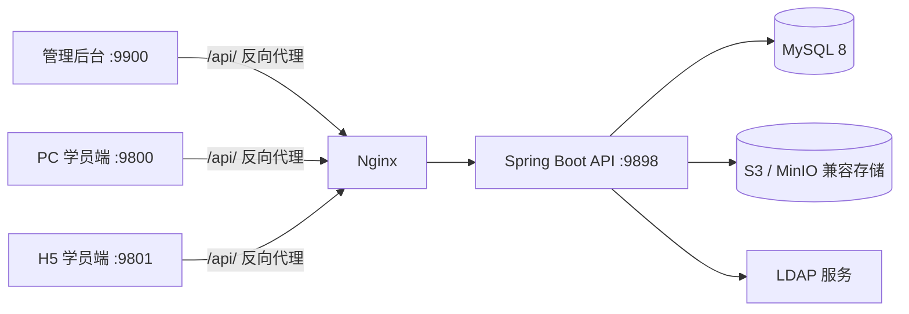

# PlayEdu 项目概要

> 生成日期：2026-09-01  
> 阅读基线：`main` 分支，提交 `da45a8355da31f80611a08456afbc8f397f926c5`（`chore(version): sync to 2.2`）  
> 阅读范围：仓库内全部受版本控制的源码、构建文件、部署配置与说明文档；重点追踪了启动初始化、鉴权、课程学习、资源存储、LDAP 同步和前后端调用链路。

## 1. 项目定位

PlayEdu 是杭州白书科技有限公司维护的开源企业内部培训系统，采用前后端分离架构。开源版主要提供：

- 部门和学员管理；
- 管理员、角色与权限管理；
- 图片、视频、课件等资源管理；
- 课程、章节、课时和附件管理；
- PC/H5 在线视频学习；
- 课时与课程学习进度记录、统计；
- S3/MinIO 兼容的私有化文件存储；
- LDAP 登录、组织与用户同步；
- 后台操作日志和基础系统配置。

当前代码版本为 2.2。仓库根目录使用 Apache License 2.0，但 README 另有必须保留产品版权标识等使用说明，实际二次开发和发布时应同时阅读 `LICENSE` 与 `README.md`。

## 2. 工程规模

静态盘点结果（排除 `.git`、`target`、`node_modules` 和锁文件统计干扰）：

| 项目 | 数量/规模 |
| --- | ---: |
| Java 源文件 | 310 |
| TypeScript/TSX 源文件 | 194 |
| 样式文件（Less/SCSS/CSS） | 99 |
| 后端 Mapper XML | 33 |
| 主要源码与配置文件 | 642 |
| 主要源码与配置行数 | 约 53,699 行 |
| 后端 REST Controller | 30 |
| 数据库领域实体 | 34 |

顶层工程由一个后端、三个前端和一套容器化部署配置组成：

```text
PlayEdu/
├─ playedu-api/       Java/Spring Boot 后端 Maven 多模块工程
├─ playedu-admin/     React 管理后台
├─ playedu-pc/        React PC 学员端
├─ playedu-h5/        React H5 学员端
├─ docker/            MySQL 与 Nginx 配置
├─ Dockerfile         前后端多阶段构建与一体化运行镜像
├─ compose.yml        应用 + MySQL 编排
├─ .env.example       Compose 环境变量示例
├─ README.md          项目说明与快速启动
└─ CHANGELOG.md       1.0-beta1 至 2.2 的版本记录
```

## 3. 总体架构



生产镜像将三个前端静态包、Nginx 和后端 JAR 放在同一个应用容器内。Nginx 分别监听 9800、9801、9900，统一把 `/api/` 去前缀后转发到后端 9898 端口；API 也可通过 Compose 映射的 9700 端口直接访问。

### 默认端口

| 服务 | 容器内端口 | 默认宿主机端口 |
| --- | ---: | ---: |
| Spring Boot API | 9898 | 9700 |
| PC 学员端 | 9800 | 9800 |
| H5 学员端 | 9801 | 9801 |
| 管理后台 | 9900 | 9900 |
| MySQL | 3306 | 23307 |

## 4. 技术栈

### 后端

- Java 17；
- Spring Boot 3.3.4；
- Spring MVC、Validation、AOP、WebSocket、异步任务、定时任务、事务；
- MyBatis-Plus 3.5.7 + XML Mapper；
- MySQL 8、HikariCP；
- Sa-Token 1.39.0 + JWT；
- AWS Java SDK S3 1.12.572，用于兼容 S3/MinIO 的对象存储；
- Gson、Hutool、Apache Commons、ip2region；
- Maven Wrapper 与 Spotless/Google Java Format。

### 前端

- React 18.2、React Router 6.9；
- TypeScript 4.9、Vite 4.2、SWC；
- Redux Toolkit + React Redux；
- Axios；
- 管理端和 PC 端使用 Ant Design 5，H5 使用 Ant Design Mobile 5；
- 管理端额外使用 ECharts、XLSX、ahooks；
- PC/H5 构建包含 Chrome 52 兼容的 legacy 输出；
- 视频播放依赖随项目静态分发的 DPlayer。

## 5. 后端模块划分

后端父工程位于 `playedu-api/pom.xml`，聚合五个 Maven 模块：

| 模块 | 职责 | 主要依赖关系 |
| --- | --- | --- |
| `playedu-common` | 用户、部门、管理员、权限、配置、LDAP 等通用领域模型、Mapper、Service、工具和上下文 | 基础模块 |
| `playedu-resource` | 资源、资源分类、视频资源扩展信息及其服务 | 依赖 `common` |
| `playedu-course` | 课程、章节、课时、附件、部门选课、学习记录和统计 | 依赖 `common`、`resource` |
| `playedu-system` | 数据库迁移、初始数据、权限和配置检查、日志切面 | 依赖 `common` |
| `playedu-api` | Spring Boot 启动入口、前后台 Controller、请求 DTO、拦截器、事件监听器、定时任务 | 依赖其余四个模块 |

启动类 `PlayeduApiApplication` 同时开启异步任务、声明式事务、定时任务、跨模块组件扫描和 Mapper 扫描。

### 分层方式

后端主要遵循以下调用方向：

```text
Controller / Request DTO
        ↓
Service 接口与实现 / Bus 编排组件
        ↓
MyBatis-Plus Mapper + XML SQL
        ↓
MySQL
```

跨领域副作用主要通过 Spring 应用事件解耦。例如删除课程、章节、课时、用户、部门或资源分类时，会发布事件，由监听器清理关联记录；完成课时时也通过事件刷新课程总进度。

## 6. 数据模型

项目支持两种数据库初始化方式：可按顺序执行 `playedu-api/sql/create_tables.sql` 和 `playedu-api/sql/init_data.sql` 完成表结构与默认超级管理员初始化；也可由 `playedu-system` 中的 `MigrationCheck` 在应用启动时检查 `migrations` 表、执行内嵌 DDL 并记录已完成迁移，随后由其他 `CommandLineRunner` 补齐默认配置、权限和系统数据。

主要数据域如下：

| 数据域 | 核心表/实体 | 说明 |
| --- | --- | --- |
| 管理权限 | `admin_users`、`admin_roles`、`admin_permissions`、`admin_user_role`、`admin_role_permission` | 管理员 RBAC |
| 审计与配置 | `admin_logs`、`app_config`、`migrations` | 操作日志、动态配置、数据库版本 |
| 组织与用户 | `departments`、`users`、`user_department`、`user_login_records` | 多部门关系、登录记录 |
| LDAP | `ldap_department`、`ldap_user`、`ldap_sync_record`、同步明细表 | LDAP 映射、同步批次与结果明细 |
| 课程 | `courses`、`course_chapters`、`course_hour`、`course_attachment` | 课程内容结构 |
| 课程范围 | `course_department_user` | 课程与部门/用户的可见范围 |
| 学习记录 | `user_course_hour_records`、`user_course_records`、学习时长记录与统计表 | 课时进度、课程进度、学习时长 |
| 资源 | `resource`、`resource_extra`、`resource_categories` 及关联表 | 图片、视频、课件及分类 |
| 下载/上传 | `course_attachment_download_log`、`user_upload_image_logs` | 附件下载与头像上传记录 |

初次启动会创建超级管理员：`admin@playedu.xyz / playedu`。生产环境应立即修改默认密码。

## 7. API 与鉴权

### API 分区

- `/backend/v1/**`：管理后台 API；
- `/api/v1/**`：PC/H5 学员 API；
- `/`：后端存活/欢迎入口。

所有接口统一返回类似 `{ code, data, msg }` 的 JSON 结构。前端 Axios 响应拦截器以 `code === 0` 作为业务成功条件，HTTP 401 时清理本地 Token 并跳转登录页。

### 鉴权机制

- 请求头使用 `Authorization: Bearer <token>`；
- Sa-Token 的默认有效期为 1,296,000 秒（15 天）；
- JWT 额外字段 `prv` 区分后台管理员与前台学员身份，避免两类 Token 混用；
- 后台拦截器加载管理员、全局配置及权限集合到线程上下文；
- 学员拦截器加载当前用户到前台线程上下文；
- 公开接口通过后台/前台白名单放行；
- 后台按钮和接口权限由权限 slug、角色关系及权限上下文共同控制；
- 全局 API 拦截器还负责通用请求控制，配置中包含 60 秒最多 360 次的限流参数。

### 管理端主要接口域

- 登录、退出、当前管理员、修改密码；
- Dashboard；
- 管理员、角色、权限；
- 部门与 LDAP 同步；
- 学员增删改查、批量导入、学习统计和学习记录清理；
- 课程、章节、课时、附件、课程学员；
- 资源分类、图片、视频、课件；
- S3/MinIO 分片上传、预签名 URL、合并与清理；
- 系统配置、缓存、管理员操作日志。

### 学员端主要接口域

- 密码登录、LDAP 登录、退出；
- 系统公开配置；
- 当前用户、头像、密码、部门与可见课程；
- 课程详情、课时详情、播放地址；
- 播放进度上报与在线心跳；
- 最近学习；
- 课程附件下载。

## 8. 核心业务流程

### 课程创建与发布

1. 管理员创建课程并设置分类、封面、描述和可见范围。
2. 为课程创建章节和课时；课时关联资源库中的视频。
3. 可批量添加课时、调整章节/课时顺序、添加课程附件。
4. 课程通过 `course_department_user` 与部门或具体用户建立可见关系。
5. 学员端根据当前部门、用户身份和分类查询可学习课程。

### 视频学习与进度

1. 学员请求课时详情，后端先检查课程可见性。
2. 播放接口返回对象存储访问地址和视频时长。
3. 前端周期性调用 `record` 上报已播放时长，并调用 `ping` 维持学习状态/累计时长。
4. 后端使用内存锁避免同一用户并发写入相同类型的学习记录。
5. `UserCourseHourRecordService` 只推进更大的已学习时长；达到视频总时长后标记课时完成。
6. 完成事件触发监听器，统计课程总课时和已完成课时数，更新 `user_course_records`；课程进度按万分比存储。
7. 最近学习、课程进度和后台统计均从这些记录聚合得到。

### 资源上传与播放

1. 管理端向后端申请 S3 multipart upload ID。
2. 后端生成各分片的预签名上传地址。
3. 浏览器直接上传分片到 S3/MinIO。
4. 后端列出并合并分片，生成资源记录和视频扩展信息。
5. 学员播放或下载时，后端校验权限后生成访问地址。
6. 演示模式下删除资源只删除数据库记录，不删除 S3 对象。

### LDAP 同步

- 可在后台手动触发，也有每小时一次的定时任务；应用刚启动时跳过第一次定时执行。
- 同步组织、用户以及 LDAP 与本地实体的映射。
- 每次同步记录批次状态、操作人、部门明细和用户明细，并支持后台查看/下载同步结果。
- LDAP 未启用或关键连接参数不完整时，服务会拒绝执行同步。

## 9. 前端工程

三个前端的共性结构为：

```text
src/
├─ api/             按领域封装 Axios 请求
├─ assets/          图片、字体和图标
├─ components/      通用组件（部分工程目录拼作 compenents）
├─ pages/           路由页面与布局
├─ routes/          React Router 路由表
├─ store/           Redux Toolkit 用户与系统配置状态
├─ utils/           Token、本地缓存和格式化工具
├─ App.tsx
└─ main.tsx
```

### 管理后台 `playedu-admin`

主要页面包括 Dashboard、资源分类、图片、视频、课件、课程与课程学员、学员与批量导入、学习统计、部门、LDAP 同步详情、管理员、角色、日志、系统配置和许可页。路由使用懒加载，左侧菜单和按钮级权限由当前管理员权限控制。

### PC 学员端 `playedu-pc`

主要页面包括登录、课程首页、课程详情、视频播放和最近学习。带头部/页脚的多种布局用于区分普通页面、登录页和沉浸式播放页。

### H5 学员端 `playedu-h5`

主要页面包括登录、首页、学习页、个人中心、修改密码、切换部门、课程详情和视频播放。功能与 PC 学员端基本一致，界面组件适配移动端。

三个前端均在启动阶段先读取系统配置；存在 Token 时再读取当前登录用户，并把两类数据写入 Redux。API 根地址由 `VITE_APP_URL` 控制，生产镜像构建时设置为 `/api/`。

## 10. 配置项

### 环境变量

关键运行参数均可从环境变量覆盖：

- `DB_HOST`、`DB_PORT`、`DB_NAME`、`DB_USER`、`DB_PASS`；
- Hikari 连接池最小/最大连接数、获取连接超时、空闲超时、最大生命周期；
- `SERVER_PORT`；
- `SA_TOKEN_IS_CONCURRENT`、`SA_TOKEN_JWT_SECRET_KEY`；
- `DEMO_MODE`；
- Compose 额外提供四个前端/API 映射端口、MySQL 映射端口和时区变量。

### 数据库动态配置

后台“系统配置”维护的 `app_config` 包含：

- 系统名称、Logo、PC/H5 地址和页脚信息；
- 播放器海报、水印文字/颜色/透明度、是否禁止拖动；
- 默认用户头像；
- S3 access key、secret key、bucket、region、endpoint 等；
- LDAP 开关、URL、管理员账号密码、Base DN。

敏感配置存储在数据库中，后台响应会按权限进行隐藏处理。

## 11. 构建与运行

### 推荐：Docker Compose

```bash
docker compose up -d --build
```

首次启动完成后：

- 管理后台：`http://localhost:9900`
- PC 学员端：`http://localhost:9800`
- H5 学员端：`http://localhost:9801`
- API：`http://localhost:9700`

如需自定义参数，先复制 `.env.example` 为 `.env`，至少修改数据库密码和 JWT 密钥。

### 本地后端

前置条件：JDK 17、MySQL 8。数据库需提前创建，表结构会由应用启动迁移自动完成。

```powershell
cd playedu-api
.\mvnw.cmd clean package
.\mvnw.cmd -pl playedu-api -am spring-boot:run
```

通过 `DB_*` 环境变量提供数据库连接；未设置时默认连接 `127.0.0.1:3306/playedu`，用户为 `root`，默认密码为空。

### 本地前端

前置条件：Node.js 20、pnpm。

```powershell
cd playedu-admin   # 或 playedu-pc / playedu-h5
pnpm install
$env:VITE_APP_URL = "http://localhost:9898"
pnpm dev
```

Vite 默认开发端口：管理端 3000、PC 端 9797、H5 端使用 Vite 默认端口。也可通过本地代理或其他 API 地址调整 `VITE_APP_URL`。

## 12. 部署方式

根 `Dockerfile` 分三阶段：

1. Node 20 Alpine：分别安装三个前端依赖并构建 gzip 静态资源；
2. Eclipse Temurin 17：Maven 离线预取依赖并打包 `playedu-api.jar`；
3. Temurin 17 运行镜像：复制 JAR、三个前端构建产物和 Nginx 配置，启动 Nginx，固定等待 MySQL 15 秒后启动 Java。

`compose.yml` 创建 `playedu` bridge 网络和持久化的 `mysql-data` volume。应用容器依赖 MySQL 容器，但当前编排只有启动顺序控制，没有 MySQL healthcheck。

## 13. 测试与质量保障现状

- 后端未发现 `src/test` 测试代码；
- 三个前端 `package.json` 均未提供 `test` 脚本；
- 管理端残留一个 Create React App 风格的 `scripts/test.js`，但当前 Vite 工程缺少与之配套的配置和脚本入口，不能视为有效测试体系；
- 构建脚本主要通过 TypeScript 编译、Vite 打包和 Maven 编译保障基础正确性；
- Java 代码配置了 Spotless 和 Google Java Format AOSP 风格；
- 未发现 TODO/FIXME 标记。

## 14. 维护关注点

以下是后续开发或上线前值得优先关注的事项：

1. **默认凭据**：Compose 数据库密码、JWT 密钥和初始管理员密码均有公开默认值，生产部署必须全部修改。
2. **跨域策略**：后端当前允许任意 Origin、Method 和 Header；若 API 暴露公网，应限制可信来源。
3. **数据库就绪**：容器以固定 `sleep 15` 等待 MySQL，慢启动环境可能启动失败，建议增加 healthcheck 和应用级重试。
4. **单机内存状态**：限流器、分布式锁实现和部分课程可见性/最近学习缓存使用内存实现；横向扩容前应评估替换为共享存储。
5. **自动化测试缺失**：鉴权、课程可见性、学习进度、迁移和资源删除等关键逻辑缺少回归测试。
6. **前端重复代码**：PC 与 H5 的 API、状态管理及部分业务逻辑高度相似，可考虑抽取共享包，降低双端修复成本。
7. **错误处理健壮性**：前端网络错误处理直接访问 `error.response.status`，断网或无响应异常可能再次抛错。
8. **已见接口字符串问题**：管理端 `learnCoursesProgress` 的 URL 模板末尾含一个空格，调用前应修正并补充测试。
9. **对象存储删除语义**：`DEMO_MODE=true` 会永久保留对象存储文件，仅适用于会周期性恢复数据库的演示环境。
10. **依赖维护**：前端核心工具链仍为 Vite 4/TypeScript 4.9，后端使用 AWS SDK v1；升级前需针对老浏览器构建与 S3 兼容服务做回归验证。

## 15. 建议的阅读入口

如需继续深入开发，建议按以下顺序阅读：

1. `README.md`、`compose.yml`、`.env.example`；
2. `playedu-api/pom.xml` 和各子模块 `pom.xml`；
3. `PlayeduApiApplication.java`、`application.yml`、`WebMvcConfig.java`；
4. `MigrationCheck.java`、`SystemDataCheck.java`、`AppConfigCheck.java`；
5. 前后台 Controller 与对应前端 `src/api`；
6. `CourseController`、`HourController`、课程/课时记录 Service 和相关事件监听器；
7. `S3Util`、`UploadController`、资源 Service；
8. `LDAPBus`、`LDAPSchedule` 和 LDAP 同步记录说明；
9. 三个前端的 `routes/index.tsx`、初始化页、Redux Slice 和主要业务页面。

## 16. 一句话总结

PlayEdu 2.2 是一个结构清晰、可通过 Docker 快速落地的单体式企业培训平台：后端按通用、资源、课程、系统和 API 分 Maven 模块组织，前端按管理端、PC 和 H5 独立交付；核心开源能力完整，但生产化时应优先补强默认安全配置、容器健康检查、共享状态方案和自动化测试。
